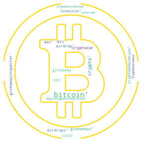

# Crypto Prices vs. Twitter Mentions

## Project Goals
Explore the relationship between the price of cryptocurrencies and their mentions and counts  on Twitter
 
Is there a  linear relationship between Twitter mentions and cryptocurrency price? 
What direction does the price move in?

Cryptocurrencies analyzed  (Top 5 market cap):
- BTC
- ETH
- ADA
- BNB
- XRP

## Installation

To use the code the required libraries will need to be installed. This can be installed by running the following line of code:

    pip install -r ./requirements.txt

To clone the repository use the following line of code:

    git clone https://github.com/twintproject/twint.git

## Collecting Crypto Tweets

To collect twiiter feed the twint libary was used. By using the cyrpto_scraper function you can collect tweets containing the string values in the tickers list. Alternatively, you can use the coin_miner function and pass in a string value of the text in tweets you want to collect.

## Collecting Crypto prices

To collect the prioces of the crypto coins we used CryptoCompare API. https://min-api.cryptocompare.com/

## Wordcloud Visualizations

To help visualize text that is frequently used in tweets the wordcloud library was used. By comparing the wordclouds of the crypto currencies we can see that they all have other cyrtpo currency mentions, especially "btc" and "bitcoin".

# Analysis

Observing the count of the tweets we can see that ADA (cardano) has the most number of tweet mentions. This is surprising since BTC (bitcoin) is thought to be the most popular and has the greatest value.

The plot of tweets per hour shows that in the 2nd half of the day for each of the dates there is a spike in the number of tweet mentions for ADA, BTC and ETH. For BNB and XRP the count of tweets for the most part is consistent. 

Calculating the correlation between the coins we see ETH has the strongest correlation with the other coins. 

The plots below show tweet counts ves value where the darker the shade of blue.

## Conclusion

There  does not appear to be a relationship between cryptocurrency prices and twitter mentions within the timeframe analyzed. With more time, we would extend the date rnage of data and attempt Tweet sentiment analysis to see if there is anything interesting there.
